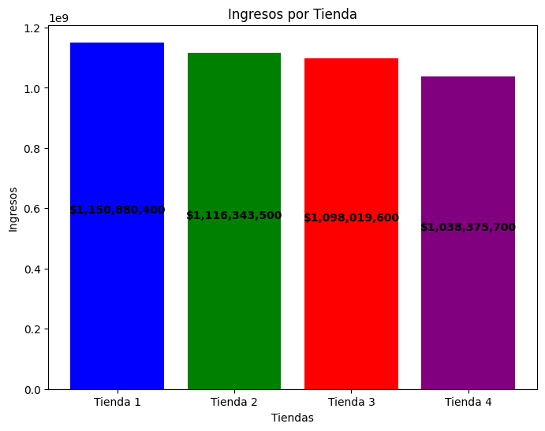
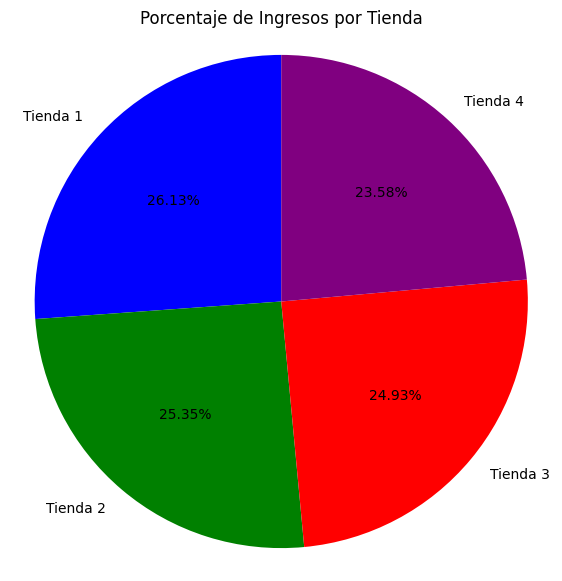
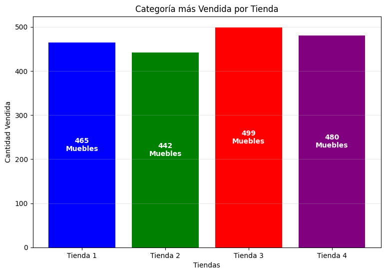
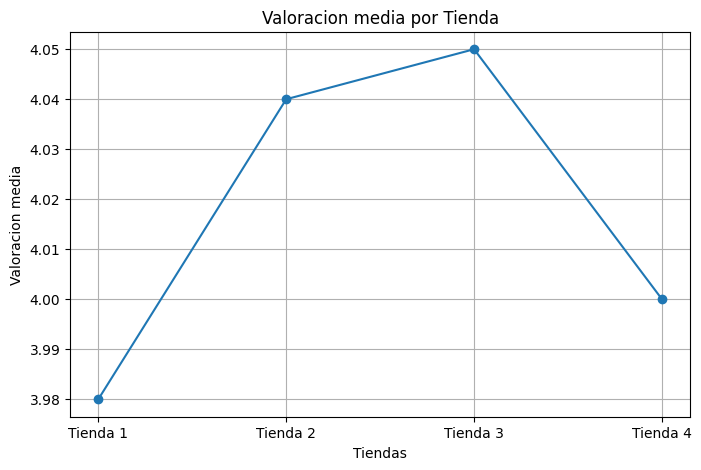
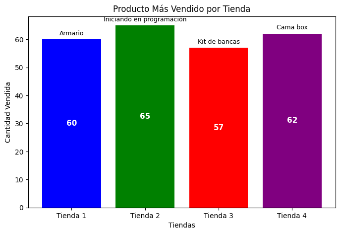
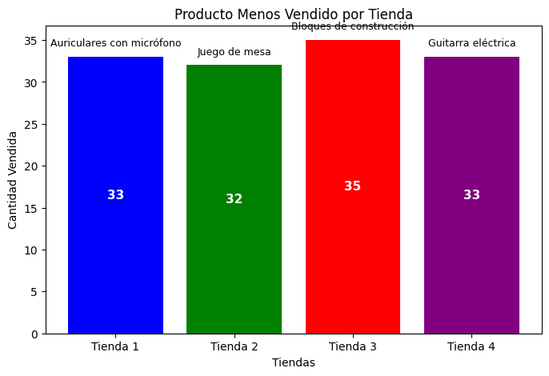
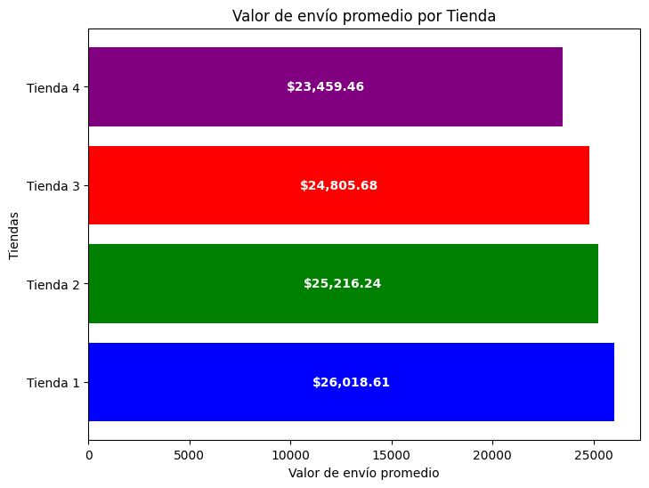
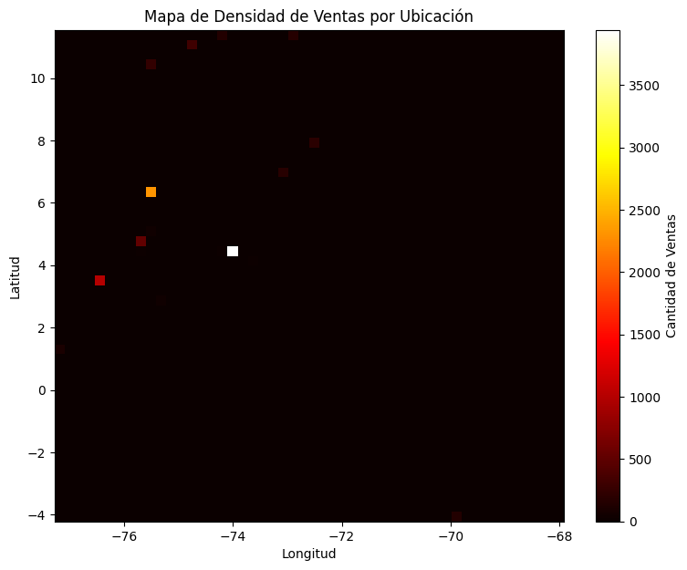
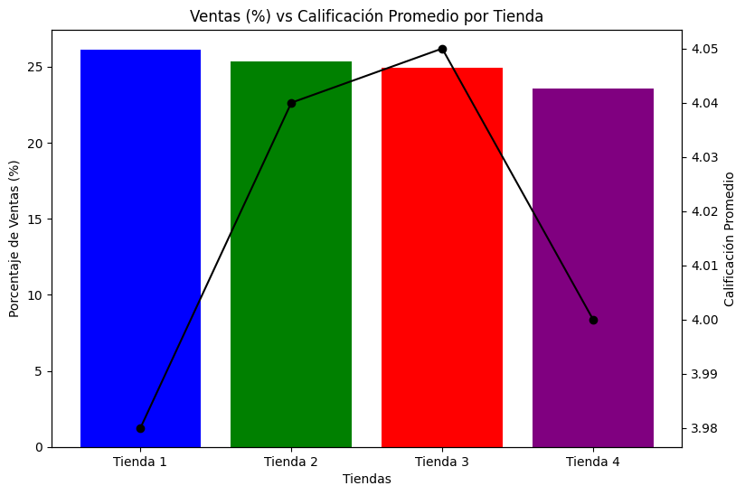

# 📊 Análisis de Ventas por Tienda

## 🎯 Descripción

Este proyecto presenta un análisis exploratorio de datos de ventas de cuatro tiendas, con el objetivo de evaluar su desempeño comercial y apoyar la toma de decisiones estratégicas. 
Se analizan indicadores clave como ingresos, ventas por categoría, calificaciones de clientes, productos más y menos vendidos, costos de envío y distribución geográfica de las ventas.

## 🎯 Objetivo

Evaluar el rendimiento de cada tienda considerando:
- Ingresos totales.
- Ventas por categoría.
- Calificación promedio de clientes.
- Productos más y menos vendidos.
- Costo promedio de envío.

## 🧰 Herramientas utilizadas

- Python 🐍  
- Pandas  
- Matplotlib  
- Google Colab

## 📈 Análisis

### 1️⃣ Ingresos por tienda

Se analizaron los ingresos totales generados por cada tienda.  
Este indicador permite identificar cuáles tiendas aportan mayor volumen de ventas al negocio.

📌 **Gráfico:** 

Además, se calculó el aporte porcentual de cada tienda.

📌 **Gráfico:** 

 

### 2️⃣ Ventas por categoría

Al analizar la categoría más vendida por cada tienda, se observa que todas las tiendas presentan un comportamiento similar:
La categoría **Muebles** domina claramente las ventas en todas las tiendas, lo cual sugiere una alta demanda constante para este tipo de productos.

📌 **Gráfico:** 

### 3️⃣ Valoración promedio por tienda

Se calculó la calificación promedio otorgada por los clientes:
La Tienda 3 presenta la mejor valoración promedio, mientras que la Tienda 1 obtiene la calificación más baja, aunque las diferencias entre tiendas son pequeñas.

📌 **Gráfico:**  

### 4️⃣ Productos más y menos vendidos por tienda

Cada tienda presenta preferencias distintas en productos, lo que refleja diferencias en el perfil del consumidor según su ubicación.

📌 **Gráficos:**  

### 5️⃣ Costo promedio de envío por tienda

La Tienda 4 presenta el menor costo promedio de envío, mientras que la Tienda 1 tiene el más alto.

📌 **Gráfico:**  

### 6️⃣ Extra: Análisis geográfico de ventas

Se utilizó la información de latitud y longitud para generar un mapa de densidad de ventas, permitiendo visualizar las zonas con mayor concentración de compras.

📌 **Gráfico:**  

### 7️⃣ Toma de decisiones

Se compara el aporte porcentual con la valoración promedio de cada tienda para apoyar la toma de decisiones.

📌 **Gráfico:**  

## 🏁 Conclusión

Considerando los indicadores analizados:

- La **Tienda 4** presenta:
  - El menor porcentaje de ventas.
  - Una calificación promedio inferior a la Tienda 2 y Tienda 3.
  - Aunque su costo de envío es el más bajo, este factor no compensa su menor desempeño comercial.

📌 **Recomendación:**  
Se recomienda evaluar el cierre o una reestructuración estratégica de la Tienda 4, priorizando recursos hacia las tiendas con mejor desempeño.

## 👤 Autor

** Oscar Argens Moreno**
Proyecto de Análisis de Datos con Python - Data Science

